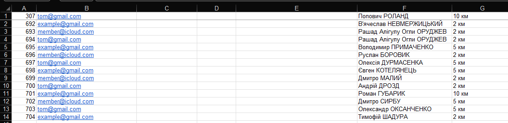

# main.py

## based on excel table like this

## from a template image

## it generates image like this

## and sends it to corresponding email


# config.py

##### configurations
* for image generation: fonts, colors, points/coordinates(where to draw text)
* SMTP(email) server login credentials
* mappings of excel columns to data types

# get_config.py

Was supposed to be a helper to get colors, drawing points and font sizes based of a reference image. (i don't rember... and don't know if it works properly.....)  
To run it, it needs an argument - reference image: ```python get_config.py ref.png```
